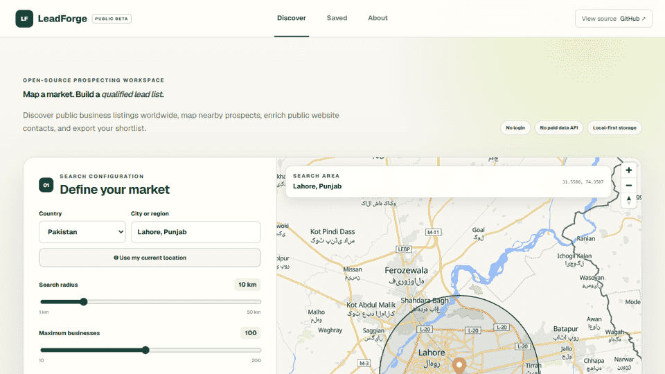

# LeadForge

LeadForge is a privacy-first, open-source workspace for discovering public business listings. Select a location, radius, and up to three standard or custom business types; review results on a map, find public website contacts on request, save a shortlist locally, and export CSV or GeoJSON.

**[Open the live application](https://leadforge-umber.vercel.app)** · **[Report an issue](https://github.com/MuhammadMuneeb007/LeadForge/issues)**

[](https://leadforge-umber.vercel.app)

## What it includes

- Worldwide country and city selection with Brisbane, Australia as the default
- Radius-based OpenStreetMap discovery with configurable result limits
- Standard categories plus safe custom type or business-name searches
- Interactive MapLibre map with individual, selectable business nodes
- Local saved lists and recent search history in IndexedDB
- Opt-in public website contact discovery with SSRF protection
- CSV import and CSV, phone, email, and GeoJSON exports
- Responsive desktop and mobile interface
- No account, paid business-data API, email provider, or server database

## Data and responsible use

Business data comes from OpenStreetMap through bounded Overpass queries. City suggestions use a local GeoNames index, and map tiles use OpenFreeMap. Coverage can be incomplete or outdated; LeadForge does not infer buying intent. Verify every record and comply with applicable privacy, anti-spam, and marketing laws.

See [data sources](docs/DATA-SOURCES.md) and the in-app [data and privacy page](https://leadforge-umber.vercel.app/about/data).

## Run locally

Requirements: Node.js 20.9 or newer and npm.

```powershell
git clone https://github.com/MuhammadMuneeb007/LeadForge.git
cd LeadForge
npm ci
Copy-Item .env.example .env.local
npm run dev
```

Open <http://localhost:3000>. If that port is occupied, run `npm run dev -- -p 3001`.

## Quality checks

```powershell
npm run lint
npm run typecheck
npm test
npm run build
npm audit --audit-level=high
```

The same checks run in GitHub Actions for every push and pull request.

## Configuration and deployment

All supported configuration is documented in [.env.example](.env.example); the project requires no secrets by default. See [deployment guidance](docs/DEPLOYMENT.md) for Vercel and other Node hosts.

The public Overpass and tile services are intended for considerate interactive use, not bulk extraction. Commercial operators should provide suitable infrastructure and distributed rate limiting.

## Security

Do not open a public issue for a suspected vulnerability. Follow [the security policy](SECURITY.md) to report it privately. The repository contains no production credentials; local `.env*` and Vercel metadata are ignored.

## License

LeadForge is released under the [MIT License](LICENSE). Upstream datasets and map tiles retain their respective licenses and attribution requirements.
